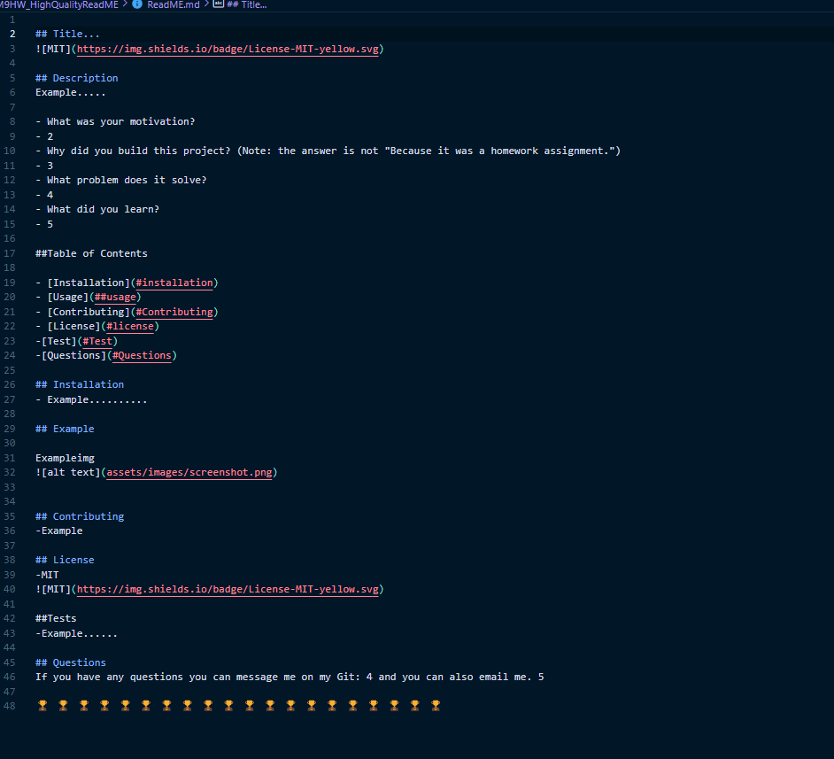

    
# Paulo-Condori ReadMe Generator 

## Description
2 files with code that work mainly in the index.js. To creat a readMe

### What was your motivation?
- I created this to pratice and better my skills as a programmer
### Why did you build this project? (Note: the answer is not "Because it was a homework assignment.")
- I need an introcution to node.js and more practice
### What problem does it solve?
- Saving time with creaing a profession level ReadMe
### What did you learn?
- More problem solving skills

## Table of Contents 

-[Installation](#installation)
-[Usage/Instructions](#Usage/Instructions)
-[Contributing](#Contributing)
-[License](#license)
-[Test](#Test)
-[Questions](#Questions)

## Installation
- right click index.js and run temrinal. inster node index.js. then program should run

## Usage/Instructions

## Example

## Contributing
-Paulo Condori

## License
-The licese used in this project was:Apache 2.0
-

##Tests 
-3. All done the tests.txt

#Questions 
If you have any questions about the repo, open an issue or contact me directly at  paulo@hotmail.com. You can find more of my work at [pcondori](pcondori1996)

# Video! 

[Creation of this ReadMe](https://watch.screencastify.com/v/cbRsfaNIeH7q6GHqgZcg)

🏆 🏆 🏆 🏆 🏆 🏆 🏆